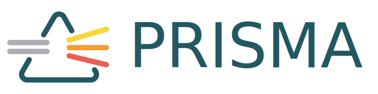

<p align="center"><a href="https://prisma.care/"></a></p>
<p align="center">
	<a href="https://laravel.com/"></a>
	<a href="https://vuejs.org/"></a>
</p>
<p align="center"><a href="https://prisma.care/">Prisma</a> is digital solution that helps personal in care homes.</p>
<p align="center">It connects with the residents that they take care of <br>
by getting to know the residents via their life stories.</p>

<p align="center">This repository is the prototype we used to test functionality in care homes. It's read-only and connects to dummy content in an Airtable database. Soon this prototype will become obsolete, as we're building the working service in the prisma-vue repository.</p>

---

## Getting Started

To start Prisma, you must first clone the repository:

```
git clone https://github.com/Prisma/prisma-app
```

Then, launch the PHP server:

```
php artisan serve
````

It is also necessary to install packages:

```
yarn install
```

Finaly, we need to compile in order to listen to each modification in
the files:

```
yarn run watch
```

It's as simple as that!

## Contributions

Before making any contribution look at the
[CONTRIBUTING](https://github.com/Prisma/prisma-app/blob/master/CONTRIBUTING.md)
file. Also, feel free to submit your bugs and suggestions by opening
an issue in the [issue tracker](https://github.com/Prisma/prisma-app/issues),
it would help us a lot.
